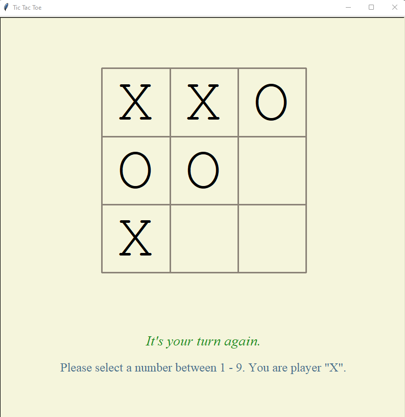

# Tic Tac Toe Python Game

A python application that utilizes the turtle module to render a tic-tac-toe game. This is a single-player game where the program will play the moves of the opponent. 

## Project Screen Shots

Game Start

After the game has started, the turtle module commands will build the game board line by line.

Your Turn First

Once the board has been built, green text will appear at the bottom to instruct you that your turn is first.

The Opponents's Turn

After each valid selection you make, the program will select a position for the opponent. The green text near the bottom will update once it is your turn again.

Game Over

The game can end if either player wins or if there is a tie. If either player O or X wins, the winning values will be highlighted.

Game Restart

The game will restart once a winner or tie has been announced. If you prefer to quit, please select the X at the top right corner to exit the game.

## Launch Instructions

Clone or download this repository to your local machine. 

Please verify that python has been installed on your machine. If it hasn't, please visit [here](https://www.python.org/downloads/) for installation instructions.

Open the file folder in VS code.

Click on the tic-tac-toe.py file so it opens in the right window view. 

Right click anywhere in the code and select "Run Python File in Terminal".

A new window will appear which will show the game board and instructions.

Your goal is to get three adjacent X's, either in a row, column, or diagonal. You also will need to block the opponent from getting three adjacent O's. Good Luck!

## Alternatively, View Live

Open a web browser [here](https://replit.com/@michelleaaa/tic-tac-toe-game#main.py).

Click the full screen button, and then the run button to launch the project.

After the tic-tac-toe board appears, please be sure to click anywhere in the window so your keyboard number presses register.

## Reflection

I created this application after finishing the Python courses in NuCamp's Back End, SQL, and DevOps Developer with Python bootcamp. After reviewing tutorials on modules I decided to code this with turtle as it's a relatively beginner-friendly option. The random, functools, and time modules were also added in to increase functionality. To make the game harder to win a detailed computer_turn function was coded instead of relying on only a random number selection. The function will more aggressively block player wins and look for it's own wins.

## References

- "Python TIC TAC TOE Tutorial | Beginner Friendly Tutorial" - https://www.youtube.com/watch?v=dK6gJw4-NCo (For guidance on win or tie checking functionality.)
- "Tic tac toe game using turtle" - https://www.youtube.com/watch?v=Qfs9-GqwYTU (For inspiration on how to draw the game board with turtle.)